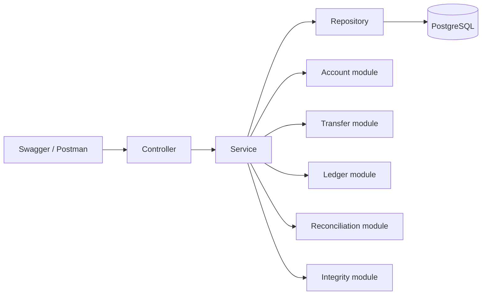

# LedgerSync

LedgerSync is an educational Spring Boot backend that processes account-to-account transfers, records an immutable double-entry ledger, prevents duplicate requests, performs compensating reversals, and reconciles internal transactions against external settlement CSV files.

It is intentionally implemented as one understandable monolith. It does **not** represent a real bank or payment system.

## Why this is more than CRUD

- Transfers are atomic: balances, the transaction, and both ledger entries commit or roll back together.
- Account rows are locked in a consistent order to protect concurrent balance updates.
- Every successful transfer creates exactly one DEBIT and one CREDIT entry of equal value.
- Idempotency keys prevent retrying the same request from moving money twice.
- Completed history is never deleted; corrections use compensating reversal transactions.
- CSV reconciliation detects matches, missing records, duplicates, amount mismatches, and status mismatches.
- An integrity endpoint checks the ledger invariants independently.

## Technology

- Java 17
- Spring Boot 4
- Spring Web MVC
- Spring Data JPA / Hibernate
- Bean Validation
- PostgreSQL
- H2 for automated tests
- Springdoc OpenAPI / Swagger UI
- Maven Wrapper
- JUnit and AssertJ

## Architecture



The Java packages are grouped by business feature and each feature follows a controller-service-repository structure. Request and response DTOs keep JPA entities out of the API contract.

## Domain model

- **Account**: account number, customer, current balance, and status.
- **FinancialTransaction**: immutable transfer request data plus its lifecycle status.
- **LedgerEntry**: an immutable DEBIT or CREDIT linked to a transaction and account.
- **ReconciliationRun**: one uploaded settlement file and its execution status.
- **SettlementRecord**: one imported CSV row.
- **ReconciliationResult**: the comparison outcome for an internal/external reference.

## Prerequisites

- Java 17+
- PostgreSQL 14+

Maven does not need to be installed because the repository contains Maven Wrapper scripts.

## Database setup

Create an empty PostgreSQL database:

```sql
CREATE DATABASE ledger_sync;
```

The default development connection is:

```text
URL:      jdbc:postgresql://localhost:5432/ledger_sync
Username: postgres
Password: postgres
```

Override it through environment variables when necessary:

```powershell
$env:DB_URL="jdbc:postgresql://localhost:5432/ledger_sync"
$env:DB_USERNAME="postgres"
$env:DB_PASSWORD="your-password"
```

Hibernate creates or updates the development tables automatically. This keeps setup simple for the portfolio version; a production version should use versioned database migrations.

## Run the application

Windows:

```powershell
.\mvnw.cmd spring-boot:run
```

macOS or Linux:

```bash
./mvnw spring-boot:run
```

Open:

- Swagger UI: <http://localhost:8080/swagger-ui.html>
- OpenAPI JSON: <http://localhost:8080/v3/api-docs>

## Quick API walkthrough

### 1. Create two accounts

```http
POST /api/accounts
Content-Type: application/json

{
  "accountNumber": "ACC001",
  "customerName": "Asha",
  "initialBalance": 10000.00,
  "status": "ACTIVE"
}
```

```http
POST /api/accounts
Content-Type: application/json

{
  "accountNumber": "ACC002",
  "customerName": "Ravi",
  "initialBalance": 5000.00,
  "status": "ACTIVE"
}
```

### 2. Transfer funds

```http
POST /api/transfers
Content-Type: application/json

{
  "sourceAccount": "ACC001",
  "destinationAccount": "ACC002",
  "amount": 500.00,
  "idempotencyKey": "TRANSFER-DEMO-001"
}
```

Sending the exact request again returns the original transaction. Reusing the key with different transfer data returns `409 Conflict`.

### 3. View an account statement

```http
GET /api/accounts/ACC001/statement
```

DEBIT values include a negative `signedAmount`; CREDIT values include a positive value.

### 4. Reverse the transfer

Copy the generated transaction reference into:

```http
POST /api/transfers/{referenceNumber}/reverse
```

The reversal creates a second completed transaction and its own balanced ledger pair. The original becomes `REVERSED` and remains available.

### 5. Reconcile a settlement file

Edit `samples/settlement-example.csv` and replace `REPLACE_WITH_TRANSACTION_REFERENCE` with a generated reference. Upload it as multipart field `file`:

```http
POST /api/reconciliation/upload
Content-Type: multipart/form-data
```

Retrieve results using:

```http
GET /api/reconciliation/{runId}
GET /api/reconciliation/{runId}/mismatches
```

The CSV format is:

```csv
reference,amount,status
TXN-REFERENCE,500.00,COMPLETED
```

### 6. Check financial integrity

```http
POST /api/integrity-check
```

The response reports whether every completed/reversed transaction has the correct DEBIT/CREDIT pair and whether global debit and credit totals balance.

## API summary

| Method | Endpoint | Purpose |
|---|---|---|
| POST | `/api/accounts` | Create an account |
| GET | `/api/accounts/{accountNumber}` | Retrieve an account |
| GET | `/api/accounts/{accountNumber}/statement` | Retrieve ledger statement |
| POST | `/api/transfers` | Transfer funds atomically |
| GET | `/api/transfers/{referenceNumber}` | Retrieve a transaction |
| POST | `/api/transfers/{referenceNumber}/reverse` | Create a compensating reversal |
| POST | `/api/reconciliation/upload` | Upload and reconcile CSV |
| GET | `/api/reconciliation/{runId}` | Retrieve all reconciliation results |
| GET | `/api/reconciliation/{runId}/mismatches` | Retrieve mismatch results |
| POST | `/api/integrity-check` | Verify ledger invariants |

## Error responses

Errors use a consistent structure:

```json
{
  "timestamp": "2026-08-19T10:00:00Z",
  "status": 422,
  "error": "Unprocessable Entity",
  "message": "Insufficient balance in account: ACC001",
  "path": "/api/transfers",
  "validationErrors": {}
}
```

Common status codes are `400` for malformed input, `404` for missing resources, `409` for uniqueness/idempotency conflicts, and `422` for valid requests that violate a financial rule.

## Run tests

```powershell
.\mvnw.cmd test
```

Tests use an isolated H2 database in PostgreSQL compatibility mode. They cover successful and rejected transfers, ledger balancing, idempotency, reversals, reconciliation outcomes, duplicate records, invalid CSV input, and the integrity check.

## Postman

Import `LedgerSync.postman_collection.json`. The collection creates two accounts, executes a transfer, reads account details, performs an integrity check, and includes templates for reversal and reconciliation requests.

## Intentional scope decisions

The first version excludes authentication, a frontend, Kafka, Redis, microservices, and Spring Batch. Those additions would increase setup and learning cost without improving the central financial correctness demonstration.

Good next additions after understanding the existing code are:

1. Spring Security with ADMIN and OPERATOR roles.
2. Flyway database migrations.
3. Docker Compose for PostgreSQL and the application.
4. Spring Batch for restartable, high-volume reconciliation.
5. Funds hold, capture, release, and expiry.
